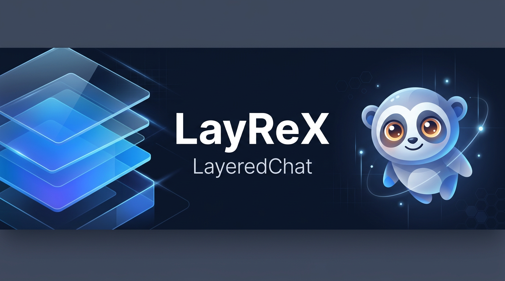

<div align="center">



# LayReX **LayeredChat**

**LayReX** is the face we put on **LayeredChat** — a composable, versioned orchestration layer for LLM tool loops in **.NET 9+**.

*Manifest-driven behavior · pluggable connectors · real data planes · stream or finish · ship as version pods.*

[](https://dotnet.microsoft.com/)
[](#license)
[](https://github.com/OniuUI/LayReX)
[](https://www.nuget.org/packages/LayeredChat.Core)
[](#contributing)

[Architecture](docs/ARCHITECTURE.md) · [Telemetry & billing](docs/TELEMETRY_AND_BILLING.md) · [Connectors matrix](docs/CONNECTORS.md)

</div>

---

## Why LayReX?

| You need | LayeredChat gives you |
|----------|------------------------|
| **Versioned “personalities”** without copy-pasting prompts | `OrchestrationProfileManifest` + registry keys (`OrchestrationRegistryKeys.Compose`) |
| **Swap models** (OpenAI, Azure, Ollama, MEAI, …) | `ILlmChatConnector`, `OpenAiCompatible`, `ExtensionsAiChatConnector` |
| **RAG / SQL / vectors** as first-class context | `IDataSourceProvider` + PostgreSQL, MongoDB, Qdrant packages |
| **SSE / buses / gateways** | `RunTurnStreamingAsync` → `OrchestrationStreamEnvelope` |
| **Remote version pods** | `ExternalForwardUri` + `HttpOrchestrationForwarder` + [VersionHost](samples/VersionHost) |

---

## Packages (NuGet-ready)

| Package | Purpose |
|--------|---------|
| `LayeredChat.Core` | Orchestrator, manifests, telemetry, streaming, forward DTOs |
| `LayeredChat.Connectors.OpenAiCompatible` | OpenAI-style HTTP (sync + SSE) |
| `LayeredChat.Connectors.ExtensionsAi` | `Microsoft.Extensions.AI.IChatClient` |
| `LayeredChat.Data.PostgreSql` | SQL slices + `postgresql_readonly_select` tool |
| `LayeredChat.Data.MongoDb` | Mongo `find` slice + `mongodb_find_json` tool |
| `LayeredChat.Data.Qdrant` | Vector search slice |
| `LayeredChat.Integrations.Mcp` | Model Context Protocol tools → `IToolCatalog` / `IToolExecutor` (official [ModelContextProtocol](https://www.nuget.org/packages/ModelContextProtocol) SDK) |

### Install from NuGet

Packages are published under the `LayeredChat.*` IDs on [nuget.org](https://www.nuget.org/packages?q=LayeredChat). Typical app references:

```bash
dotnet add package LayeredChat.Core
dotnet add package LayeredChat.Connectors.OpenAiCompatible
```

Add connectors, data providers, or MCP as needed (`LayeredChat.Connectors.ExtensionsAi`, `LayeredChat.Data.PostgreSql`, `LayeredChat.Integrations.Mcp`, …).

**Publish (maintainers):** In the LayReX GitHub repo, add a secret `NUGET_API_KEY` (API key from [nuget.org account API keys](https://www.nuget.org/account/apikeys), scope *Push* for `LayeredChat.*`). Then either push a git tag `v0.2.0`, or run the **Publish NuGet** workflow manually and enter the same version string (without `v`).

**Solution:** `LayeredChat.sln` in this folder.

**Layout:** `src/Core/LayeredChat.Core/` is split by feature (`Chat/`, `Llm/`, `Tools/`, `Context/`, `Profiles/`, `Orchestration/`, `Forward/`, `Telemetry/`, `Agents/` — public namespace remains `LayeredChat`). Also: `src/Connectors/...`, `src/Data/...`, `src/Integrations/Mcp`, `tests/`, `samples/VersionHost`, `deploy/version-pod`.

**Vector mark (SVG, crisp at any size):** [`docs/assets/layeredx-readme-hero.svg`](docs/assets/layeredx-readme-hero.svg)

---

## Easiest API: `LayeredChatHost`

Instead of new `LayeredChatOrchestrator(...)` with five dependencies, build a **single host object**:

```csharp
var host = LayeredChatHost.CreateBuilder()
    .UseConnector(myConnector)                    // ILlmChatConnector (required)
    .UseDefinitions(orchestrationDefinition)      // or .UseDefinitionRegistry(myRegistry)
    .UseTools(myToolCatalog, myToolExecutor)      // optional; defaults to no tools
    .UseDataSources(myDataSourceRegistry)        // optional; defaults to empty
    .Build();

var result = await host.RunTurnAsync(new LayeredChatTurnRequest { /* ... */ });
// host.Orchestrator — same instance if you need the raw type
// host.CreateAgent(registryKey) — IChatAgent for fixed-profile turns
```

For **dependency injection**, register one factory that returns `LayeredChatHost` (or register `LayeredChatOrchestrator` resolved from `sp.GetRequiredService<LayeredChatHost>().Orchestrator`). Decline-all tools: `NoOpToolExecutor.Instance` with an empty `DictionaryToolCatalog`.

---

## Quick start (manual wiring)

1. Define a **manifest** (JSON) or `OrchestrationProfileManifest` in code.  
2. **Register** with `InMemoryOrchestrationDefinitionRegistry` or your own `IOrchestrationDefinitionRegistry`.  
3. Wire **connector**, `IToolCatalog`, `IToolExecutor`, `IDataSourceRegistry`.  
4. Call **`RunTurnAsync`** (finished turn) or **`RunTurnStreamingAsync`** (envelopes for SSE / SignalR / Kafka).

```csharp
var registry = new InMemoryOrchestrationDefinitionRegistry();
registry.Register(new OrchestrationDefinition
{
    Manifest = new OrchestrationProfileManifest
    {
        OrchestrationId = "support",
        SemanticVersion = "2.1.0",
        DisplayName = "Support bot",
        AllowedToolNames = new[] { "kb_search" },
        DataSourceIdsInOrder = new[] { "policies_pg" },
        Parameters = new Dictionary<string, string>(StringComparer.OrdinalIgnoreCase)
        {
            ["pgsql.sql"] = "SELECT title, body FROM policies LIMIT 20;"
        }
    }
});

var http = new HttpClient { Timeout = TimeSpan.FromMinutes(5) };
var connector = new OpenAiCompatibleChatConnector(http, new OpenAiCompatibleOptions
{
    BaseUri = new Uri("https://api.openai.com/v1/"),
    Model = "gpt-4o-mini",
    ApiKey = Environment.GetEnvironmentVariable("OPENAI_API_KEY")
});

var dataSources = new DataSourceRegistry(new IDataSourceProvider[]
{
    new PostgreSqlParameterDataSource("policies_pg", npgsqlDataSource)
});

var orchestrator = new LayeredChatOrchestrator(
    connector,
    myToolExecutor,
    myToolCatalog,
    registry,
    dataSources);

var result = await orchestrator.RunTurnAsync(new LayeredChatTurnRequest
{
    OrchestrationRegistryKey = OrchestrationRegistryKeys.Compose("support", "2.1.0"),
    SystemInstructionText = "You are a concise support agent.",
    UserMessageContent = "How do I reset my password?",
    PriorMessages = Array.Empty<ChatMessage>(),
    Session = new OrchestrationSessionContext { TenantKey = "acme" }
});
```

---

## Agents (named orchestration profiles)

- **`IChatAgent`** — fixed `OrchestrationRegistryKey` with `RunTurnAsync` / `RunTurnStreamingAsync` over `AgentTurnInput` (no key on each call).
- **`LayeredChatAgent`** — thin wrapper over `LayeredChatOrchestrator`.
- **`LayeredChatAgentRegistry`** — register many agents (e.g. `sales`, `support`) on one orchestrator.

## Model Context Protocol (MCP)

1. `await McpToolSession.ConnectStdioAsync(...)` or `ConnectAsync(IClientTransport, ...)`.
2. Set manifest **`AllowedToolNames`** to the MCP tool names (use `McpSessionOptions.ToolNamePrefix` per server to avoid collisions).
3. Wire orchestrator:

```csharp
var mcp = await McpToolSession.ConnectStdioAsync(new StdioClientTransportOptions
{
    Name = "tools",
    Command = "npx",
    Arguments = ["-y", "@modelcontextprotocol/server-filesystem", "."]
}, new McpSessionOptions { ToolNamePrefix = "fs_" });

var catalog = McpOrchestrationWiring.CombineHostCatalogThenMcp(hostCatalog, mcp.Catalog);
var executor = McpOrchestrationWiring.RoutePrefixedMcpThenHost("fs_", mcp.Executor, hostExecutor);
```

4. Use **`CompositeToolCatalog`** and **`RoutedToolExecutor`** in Core for other merge / routing patterns.

Multi-tenant hosts can implement **`IMcpToolSessionFactory`** (`LayeredChat.Integrations.Mcp`) to create or pool `McpToolSession` instances per scope key (tenant, user, etc.).

## Connectors & LLM versioning

- **OpenAI-compatible HTTP** — one client for OpenAI, Azure OpenAI, Ollama, vLLM, LiteLLM gateways, etc. Per-request model: `LlmRequestOptions.ModelNameOverride`. See [docs/CONNECTORS.md](docs/CONNECTORS.md) and **`OpenAiCompatibleWellKnownEndpoints`** for common base URLs.
- **Microsoft.Extensions.AI** — reuse your existing `IChatClient` registration; tools use declaration-only `AIFunctionFactory.CreateDeclaration`.
- **Manifest hints** — `LlmAdapterProfileId`, `PreferredConnectorKind`; runtime merge via `LayeredChatTurnRequest.ModelAdapterProfile` (`LlmModelAdapterProfile`).

---

## Data planes

- **PostgreSQL** — `PostgreSqlParameterDataSource` (`pgsql.sql`, `pgsql.maxRows`); tool `PostgreSqlReadonlySelectTool` with `SELECT` / `WITH` guardrails.
- **MongoDB** — `MongoJsonFindDataSource`; tool `MongoFindTool`.
- **Qdrant** — `QdrantVectorSearchDataSource` (vector JSON in manifest or session `qdrant.queryVectorJson`).
- **Composition** — `CompositeDataSourceRegistry` for tenant/global providers.

---

## Streaming vs finished turns

- **Finished:** `RunTurnAsync` → `LayeredChatTurnResult` (messages, tokens, `CorrelationId`, `OrchestrationId`, `SemanticVersion`).
- **Streamed:** `RunTurnStreamingAsync` → `OrchestrationStreamEnvelope` (`AssistantTextDelta`, tool lifecycle, `TurnResultSummary`, `TurnCompleted`).

---

## Observability

- `IOrchestrationTelemetry` on `LayeredChatTurnRequest.Hooks` — fan out with `ChainedOrchestrationTelemetry`. See [docs/TELEMETRY_AND_BILLING.md](docs/TELEMETRY_AND_BILLING.md) for `UsageUpdate`, `ModelRoundCompleted`, and turn totals.
- Propagate **`OrchestrationSessionContext.CorrelationId`** end-to-end.

---

## Version pods (containers)

Manifest: `externalForwardUri`, `externalForwardTimeoutSeconds`.  
Host: `IHttpOrchestrationForwarder` (`HttpOrchestrationForwarder`).

- **Sample:** [`samples/VersionHost`](samples/VersionHost) — `POST /v1/orchestration/forward`
- **Image build** (run from **this** directory — the folder that contains `LayeredChat.sln`):  
  `docker build -f deploy/version-pod/Dockerfile -t layered-chat-version-host:latest .`
- **Compose / Kubernetes:** [`deploy/version-pod/`](deploy/version-pod/)

---

## Build & test

```bash
dotnet build LayeredChat.sln
dotnet test tests/LayeredChat.Core.Tests/LayeredChat.Core.Tests.csproj
```

---

## Contributing

We love PRs that stay focused and match existing style.

1. **Open an issue** first for larger changes (connectors, manifest schema, breaking API).  
2. **Small fixes** (docs, tests, typos) can go straight to a PR.  
3. **Core rule:** `LayeredChat.Core` stays free of Npgsql, MongoDB, Qdrant, and product domains — put adapters in the named packages.  
4. **Tests:** extend `LayeredChat.Core.Tests` or add a test project next to new packages.  
5. **Consumers** embedding this tree in a larger repo: keep the same `dotnet` commands with your path prefix (e.g. `libs/LayeredChat/`).

If you use this library in the wild, a ⭐ on the repo or a short issue with your stack helps us prioritize.

---

## Security

- Treat SQL / Mongo tools as **convenience**, not authorization — use read-only DB roles and tenant-scoped connections.  
- **Never** put secrets inside manifests; resolve keys in the host and pass via `OrchestrationSessionContext.Properties` if needed.

---

## License

**MIT** — see [`LICENSE`](LICENSE). Each package also sets `PackageLicenseExpression: MIT` in MSBuild.

---

## Repository

Canonical home: **[github.com/OniuUI/LayReX](https://github.com/OniuUI/LayReX)**.

**LayReX · LayeredChat** originated in the Boligsektor codebase; this repository is the standalone OSS distribution. Hero artwork: [`docs/assets/layeredx-hero.png`](docs/assets/layeredx-hero.png) (replace with your own branding if you fork).
